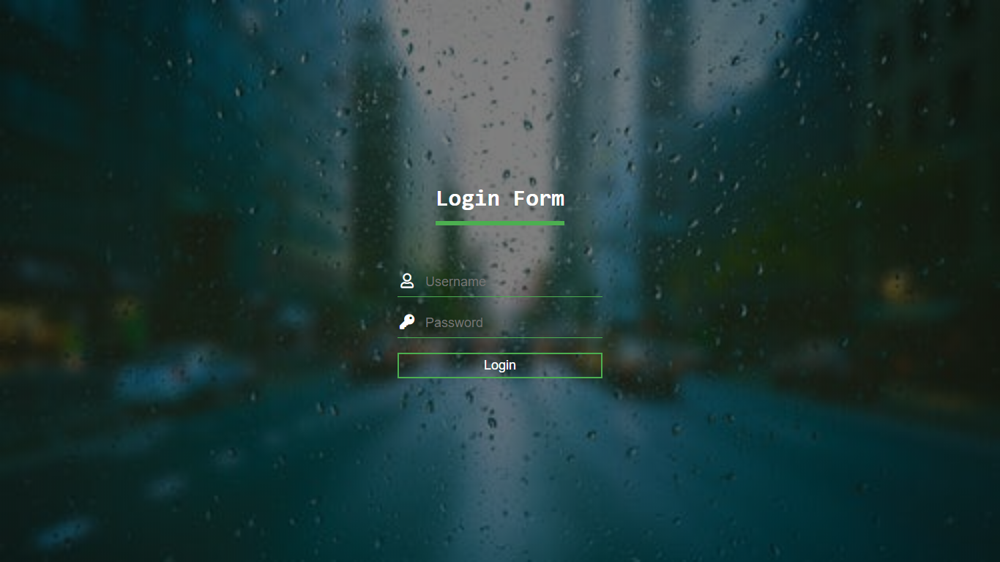

# Theatre

> This is a React App which references an API and displays the data.

---

### Table of Contents

- [Description](#description)
- [How To Use](#how-to-use)
- [Author Info](#author-info)

---

## Description

- In this App, the user can log in using their credentials. After loggin in, a JWT will be generated which will be used to authenticate the user and fetch other details like categories, sub-categories and topics which are displayed in the dropdown menu. Finally, the submit button will use the values from the dropdown to send a request to the server and return true if the request has been accepted.
- Username: Test
- Password: Test123

#### Technologies

- ReactJs
- HTML
- CSS

---

## How To Use

#### Installation
- To install project, simply clone the repository and run "npm install" in the terminal to install all the dependencies.
- To run project, run "npm start" in the terminal and the project will be hosted at : "http://localhost:3000/"

#### API Reference

1. POST : 'http://18.220.240.163:8080/rest/authenticate/login' - required username and password to be passed in body and returns JWT in response.
2. GET : 'http://18.220.240.163:8080/rest/admin/categories' - requires JWT to be passed as Authorization Header.
3. GET : 'http://18.220.240.163:8080/rest/admin/subcategories' - requires JWT to be passed as Authorization Header.
4. GET : 'http://18.220.240.163:8080/rest/admin/topics' - requires JWT to be passed as Authorization Header.
5. POST : 'http://18.220.240.163:8080/rest/admin/matches' - requires JWT to be passed as Authorization Header and "name", "imageUrl", "categoryId", "subCategoryId", "topicId","startDate" and "endDate" to be passed in body. Sample parameters: '{"name":"Friend match2","imageUrl":"newurl","categoryId":"2","subCategoryId":"2","topicId":"60","startDate":"2020-08-07T18:30:00.000Z","endDate":"2021-08-25T18:30:00.000Z"}'

---

## Author Info

- LinkedIn - [@lakshdhamija](https://linkedin.com/in/lakshdhamija)
